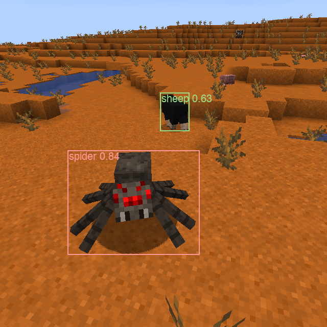

# minecraft-fcos

Object Detection - Fine-tuning FCOS for Minecraft mobs

## Overview
This repo contains the training code and a script to run the model live on Minecraft through [MCio](https://modrinth.com/mod/mcio).

